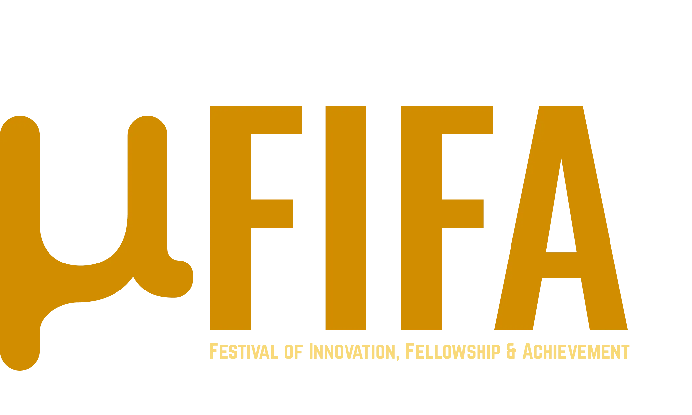
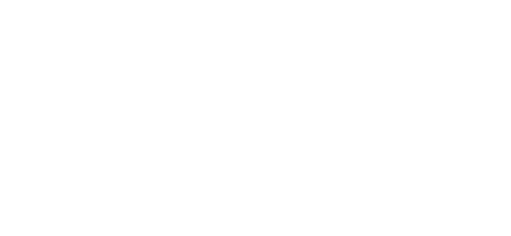
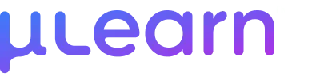

<h1 align="center">
  <a href="https://mufifa.mulearn.org">µFIFA</a>
</h1>

Welcome to **µFIFA**, a gamified learning platform and large-scale innovation movement that turns education into a collaborative, competitive experience inspired by the FIFA World Cup.

Developed and presented by **µLearn MCE** in partnership with the **µLearn Foundation** (GTech µLearn).

---

## What is µFIFA?

**µFIFA** is designed to foster peer learning, skill acquisition, and community collaboration. Participants choose a specific domain of expertise, join one of the national squads (e.g., Brazil, Argentina, France, Portugal), and complete real-world challenges to earn **µPoints** for themselves and their team.

### Key Features

- **National Squads**: Align with a country squad representing your community/college and compete collectively.
- **Skill Domains**: Learn and excel across five key attributes:
  - Creativity
  - Branding
  - Innovation
  - Teamwork
  - Execution
- **Dynamic Player Cards**: Access personalized dashboard cards featuring your cumulative Level Badge (shield emblem), custom stats grid, and custom avatar.
- **Match Predictions**: Predict real FIFA match outcomes to win additional µPoints.
- **Real-Time Leaderboards**: Live standings for both individual players and team squads.
- **Task Verification**: Seamless challenge submission, review, and point crediting flow.

---

## Technology Stack

The platform is built using modern web development standards:

- **Frontend**: [Next.js](https://nextjs.org/) (React, App Router, Tailwind CSS, and Vanilla CSS animations)
- **Backend & Database**: [Supabase](https://supabase.com/) (PostgreSQL database, real-time subscriptions, and authentication)

---

## Organizers & Contributors

This project is a collaborative effort:

- **[GTech µLearn MCE](https://mulearn.org/)**: The Marian Engineering College chapter of GTech µLearn, leading local implementation and development.
- **[GTech µLearn Foundation](https://mulearn.org/)**: The global foundation facilitating the peer learning ecosystem across Kerala.

&nbsp;&nbsp;&nbsp;&nbsp;&nbsp;&nbsp;&nbsp;&nbsp;&nbsp;&nbsp;&nbsp;&nbsp;&nbsp;&nbsp;&nbsp;&nbsp;

